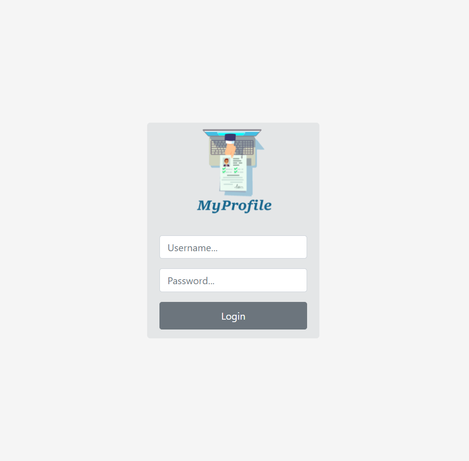

<p align="center">
  
</p>

<h1 align="center">
    
</h1>

<br>

## 🧪 Tecnologias

Esse projeto foi desenvolvido com as seguintes tecnologias:

- [React](https://reactjs.org)
- [JavaScript](https://www.javascript.com/)

## 🚀 Como executar

Clone o projeto e acesse a pasta do mesmo.

```bash
$ git clone https://github.com/padraorezende/teste-dng.git
$ cd teste-dng
```

Para iniciá-lo, siga os passos abaixo:
```bash
# Instalar as dependências
$ yarn

# Iniciar o projeto
$ yarn start
```
O app estará disponível no seu browser pelo endereço http://localhost:3000.


## 💻 Projeto

Crie um site utilizando HTML, CSS e JavaScript. O site será o seu portfólio e para acessá-lo os usuários precisarão informar as seguintes credenciais:
   - Usuário: administradordng
   - Senha: processoseletivo
  
Caso as credenciais estejam incorretas, deve ser exibida uma mensagem de erro para quem está tentando acessar e o login não deve ser permitido.

Caso as credenciais estejam corretas, o usuário deve ser redirecionado para a tela “Meu Perfil”.

Ao acessar a tela “Meu perfil”, deve existir uma apresentação sua com seu nome, cidade, o que gosta de fazer, experiências que gostaria de compartilhar, etc. Fique a vontade para colocar as informações que achar necessário. 

Além da apresentação deve existir um botão “Sair” que ao ser clicado, redireciona o usuário para a tela de login. E assim, o usuário pode fazer todo o processo novamente.


